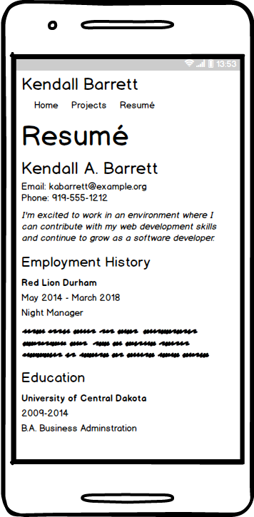
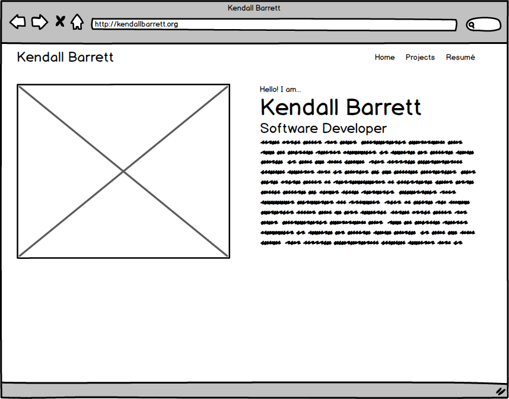

# Build a portfolio site

## Directions

In this homework, you will build a web site about yourself. The website should have:

* A homepage with your picture and some information introducing yourself, as well as links to other places you can be found online.
* A project page that lists your previous project and links to it on GitHub.
* A page showing your resumé in HTML.

Your website should use CSS for layout and semantic HTML for markup. It should be responsive and look good on mobile devices as well as on the desktop.

## Collaborators

You will work with one other collaborator on this homework, who will be assigned in class. Each person should turn in their own portfolio, but you should work together to provide support and feedback to each other. You will have check-ins as a group with an instructor, one individual and one with other groups from the class. Figure out with your partner a schedule that works for checking in and a way that you like to work together (Google Hangouts, Discord, Facetime, Slack voice call).

* Morning check-in (one team, one instructor), see slack for schedule.
* 3PM Check in with larger group and one instructor, see slack for Zoom link.

## Example wireframes

Your site does not have to have the same layout as these wireframes, but they are a good place to get started if you do not have another idea.

### Mobile

### desktop

